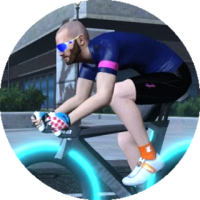

# woojinkim.org

**김우진**. 게임회사에서 일하는 시스템디자이너.

* 이메일: me@woojinkim.org
* 블로그: https://neoocean.net/blog/

## 시스템디자인

- **시스템 설계**: 요구사항을 효과적으로 달성할 수 있는 단순한 시스템 설계 및 개발진행.
- **실행 가능한 계획**: 모호할 수 있는 컨셉으로부터 유연하고 실행 가능한 계획을 도출 및 실행.
- **개념정의**: 복잡해 보이는 시스템을 단순한 개념을 통해 이해하기 쉽게 정리.

## 경험

* 시스템디자인, [스마일게이트](http://www.smilegate.com/) (현재)

- 게임디자인 및 UI디자인, [넷게임즈](http://www.natgames.co.kr/) (2017-2018)
  - [오버히트](https://overhit.nexon.com/) 프로젝트 개발 및 라이브서비스.
    - UI디자인, 시스템디자인, 이벤트 설계 및 집행.
- 시스템디자인, 블루홀스튜디오 (현 [크래프톤](http://krafton.com/)) (2015-2016)
  - 'Project T2' 참여.
    - 게임 전반의 시스템디자인.
- 시스템디자인, [엔씨소프트](http://ncsoft.com/) (2010-2014)
  - ''리니지 이터널'' 프로젝트 참여.
    - 엔드컨텐츠 디자인, 인하우스툴, 랜덤던전 개발에 시스템디자인 역할로 참여.
  - ''명인장기'', ''미션아르피아'' 개발 및 라이브서비스.
    - 플래시 기반의 미니게임 게임디자인, 명인장기 모바일 개발.
- 게임디자인, [넥슨](https://www.nexon.com/) (2008-2009)
  - [크레이지슈팅 버블파이터](http://bf.nexon.com/) 개발 및 라이브서비스.
    - 보조 게임디자이너. 게임디자인 전반의 문제해결에 기여.
- 시스템디자인, [그라비티](http://gravity.co.kr/) (2005-2007)
  - ''라그나로크 온라인 2' 개발 및 라이브서비스.
    - 퀘스트라이터, 전투 및 밸런스디자인.

## [주요 포스팅](https://neoocean.net/blog/)

* [공개 기획서 제작 제안](https://neoocean.net/blog/proposal-for-making-open-game-design-document)
* [현대 상업용 게임 프로젝트에서 게임디자이너의 역할](https://neoocean.net/blog/game-designers-in-modern-commercial-game-projects)
* [유료재화와 무료재화 구분](https://neoocean.net/blog/free-gem-vs-paid-gem)
* [아쉬움에 세계를 떠나지 못하다](https://neoocean.net/blog/sorry-that-cannot-leave-the-world)

# 다른 링크

* Github: <https://github.com/neoocean>